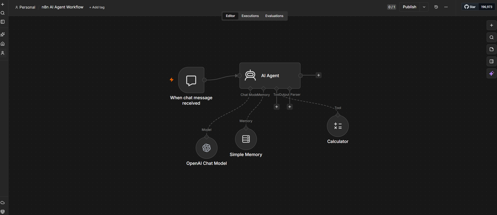

# n8n AI Agent Workflow

A focused n8n chat-agent workflow with an OpenAI chat model, session memory, automatic calculator-tool usage, and an importable sanitized workflow definition.



## Workflow Overview

```text
Chat message received
        ↓
AI Agent
   ├── OpenAI Chat Model
   ├── Simple Memory
   └── Calculator Tool
        ↓
Final chat response
```

## Features

- n8n chat-trigger interface
- OpenAI model integration
- automatic calculator-tool selection
- short-term conversation memory
- intermediate agent-step output
- importable workflow JSON
- sanitized public export without credentials or instance-specific metadata

## Workflow Nodes

### When Chat Message Received

Starts the workflow when a user submits a message through the n8n chat interface.

### AI Agent

Receives the user message, decides whether a tool is required, and produces the final response.

### OpenAI Chat Model

Provides the language-model reasoning used by the AI Agent.

The public workflow does not include OpenAI credentials. After importing, users must configure their own credential.

### Simple Memory

Keeps recent conversation context during the active chat session.

This is short-term workflow memory and is not a persistent database.

### Calculator

Allows the agent to perform arithmetic when calculation is required.

## Repository Structure

```text
n8n-ai-agent-workflow/
├── docs/
│   └── workflow.png
├── workflow/
│   └── n8n-ai-agent-workflow-public.json
├── .gitignore
├── LICENSE
├── README.md
└── sanitize_workflow.py
```

## Import the Workflow

1. Open n8n.
2. Create a new workflow.
3. Open the workflow menu.
4. Choose **Import from File**.
5. Select:

```text
workflow/n8n-ai-agent-workflow-public.json
```

6. Open the **OpenAI Chat Model** node.
7. Add or select your own OpenAI credential.
8. Save and test the workflow.

## Test Examples

```text
What is 25 multiplied by 18?
```

The agent should use the calculator tool.

```text
My name is Chathuranga.
```

Then ask:

```text
What is my name?
```

The memory node should provide the earlier context during the same session.

```text
Explain machine learning briefly.
```

The agent should answer directly without using the calculator.

## Workflow Sanitization

The original n8n export may contain credential references and instance-specific metadata.

The included script creates a safer public copy:

```bash
python3 sanitize_workflow.py
```

It removes fields such as:

```text
credentials
webhookId
versionId
instanceId
workflow ID
node IDs
```

The original private export is excluded through `.gitignore`.

## Security

This repository does not include:

- OpenAI API keys
- n8n credential values
- passwords
- access tokens
- private webhook identifiers
- n8n instance identifiers

Users must configure their own OpenAI credential after importing the public workflow.

## Current Limitations

- memory is session-based and not persisted in a database
- only one calculator tool is included
- no external APIs or business-system integrations
- no automated workflow evaluation
- no human approval step
- no production monitoring or deployment configuration

## Scope

This project is intentionally small. It demonstrates how n8n can orchestrate:

```text
user input
→ AI agent
→ model reasoning
→ tool selection
→ memory
→ final response
```

It is a focused workflow example, not a production multi-agent platform.

## License

This project is available under the MIT License. See [LICENSE](LICENSE).